# Домашка по тулингу. DevTools

## Содержание 

- [Описание](#about)
- [Вкладка Network](#network)
- [Вкладка Performance](#performance)
- [Вкладка Coverage](#coverage)

## Описание  

Тестировалась desktop-версию сайта https://lifehacker.ru. 
Не все скриншоты делались в один день, поэтому данные на них (время запросов, размеры ресурсов и т.д.) могут незначительно отличаться друг от друга.

## Вкладка Network  
([вернуться к содержанию](#contents))

Профиль загрузки ресурсов при открытии страницы https://lifehacker.ru ([HAR-архив](DevTools/Network/lifehacker.ru.har)).

### Дублирование ресурсов.

Два раза отправляется `GET-запрос 1077477&_embed`:

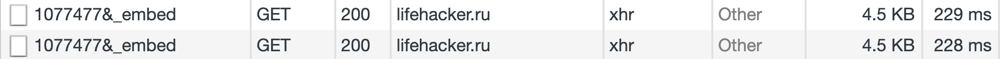

Многие одинаковых запросов и скриптов от гугла и яндекса.

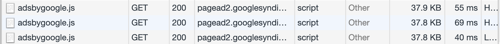
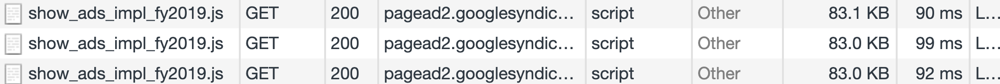
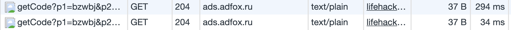

Но вообще сложно определить, один ли и тот же запрос отправляется или нет. Например, есть ряд "похожих" запросов, где похоже все кроме, одного параметра. Возможно, этот параметр отличает "уникальность" содержимого запроса и он по разному обрабатывается. А может это просто порядковый номер запроса или хэш, определяющий уникальность запроса, но не его содержимого, и тогда этот запрос можно считать лишним.

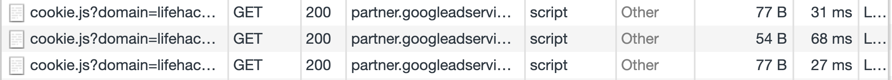
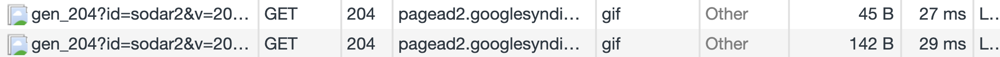

Вот здесь, например, отличается параметр id - запрос идет за разными баннерами.
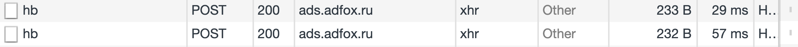

Но в целом, кажется, что необходим опыт работы с рекламными сервисами Google/Yandex, чтобы разобраться в том, является ли тот или иной запрос уникальным или лишним.

 С запросами непосредственно к lifehacker.ru, тоже все неоднозначно. Например, есть несколько ресурсов с похожими именами: `all.min.css`, `all.min.js`, `app.js`, - и имеющих похожее содержание (например, частично совпадают названия css-классов в `all.min.css`):

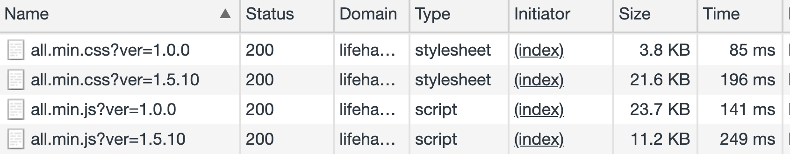
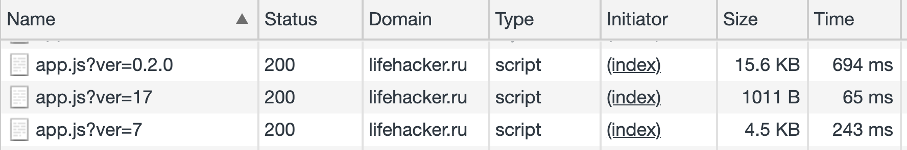

Но лежат они при этом в разных местах, например, в темах vs плагины. Скорее всего это лишь кажущаяся похожесть, на самом деле файлы разные (другое дело, что большая часть кода в этих файлах не используется при загрузке страницы, но об этом позже).

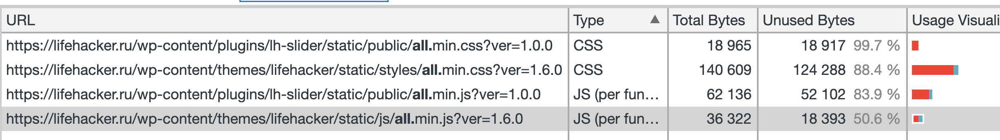
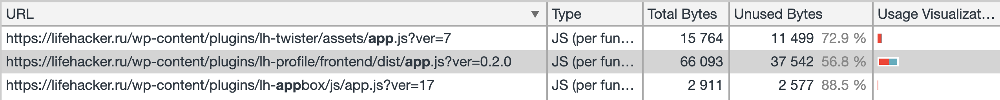

### Лишний размер ресурсов

Многие картинки не до конца оптимизированы. Я скачал несколько jpg/png файлов и попробовал сжать с помощью `ImageOptim` с настройками по умолчанию - получил сжатие `9%` (`345Кб`).

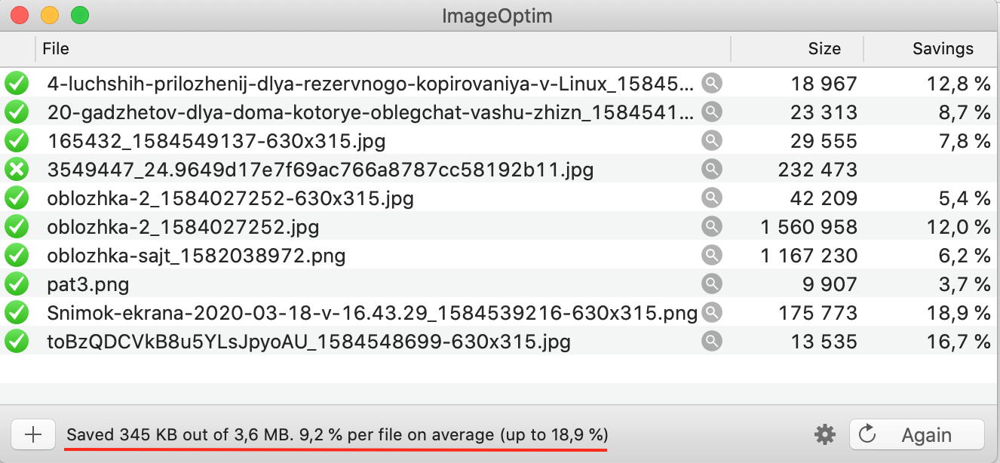

Одновременно загружаются 2 картинки `oblozhka-2`: большого и маленького разрешения.
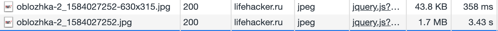

Сама картинка.

При этом во вьюпорте экране ни одной из этих двух картинок не видно.

### Медленно загружающиеся ресурсы

В основном это картинки. Но также есть:
- скрипты `wordpress`, в том числе `wp-embed.min.js`, позволяющий вставлять код из других ресурсов (например, c youtube) и плагин авторизации `LH-page`. 
- библиотеки для работы с рекламой (`loader.js`, `header-bidding.js`, `publishertag.js` и др.)

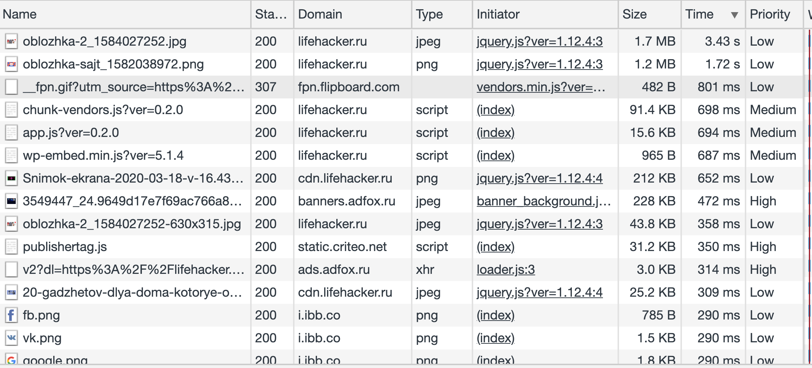

### Ресурсы, блокирующие загрузку

Так и не нашел, как на вкладке `Network` получить список ресурсов, блокирующих загрузку.
Обычно для этого использую вкладку `Аудит` (`Lighthouse`). Ну и в целом блокирующим ресурсом, видимо, будет как минимум любой js, подключенные в head без атрибутов `async/defer`, и любой css (не скрытый явно от загрузки).

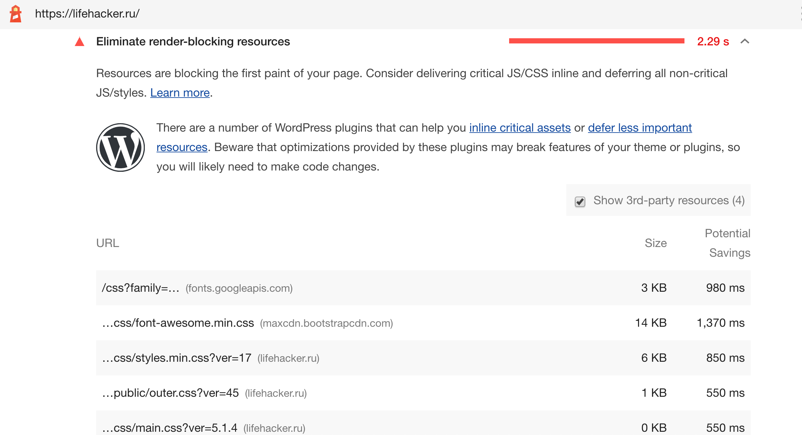
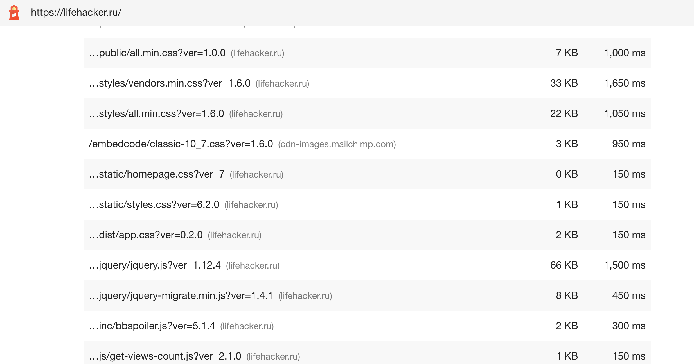

## Вкладка Performance 
([вернуться к содержанию](#contents))

Профиль загрузки страницы https://lifehacker.ru ([посмотреть](Profile.json)).

Время от начала загрузки до события First Paint `~1748ms`.

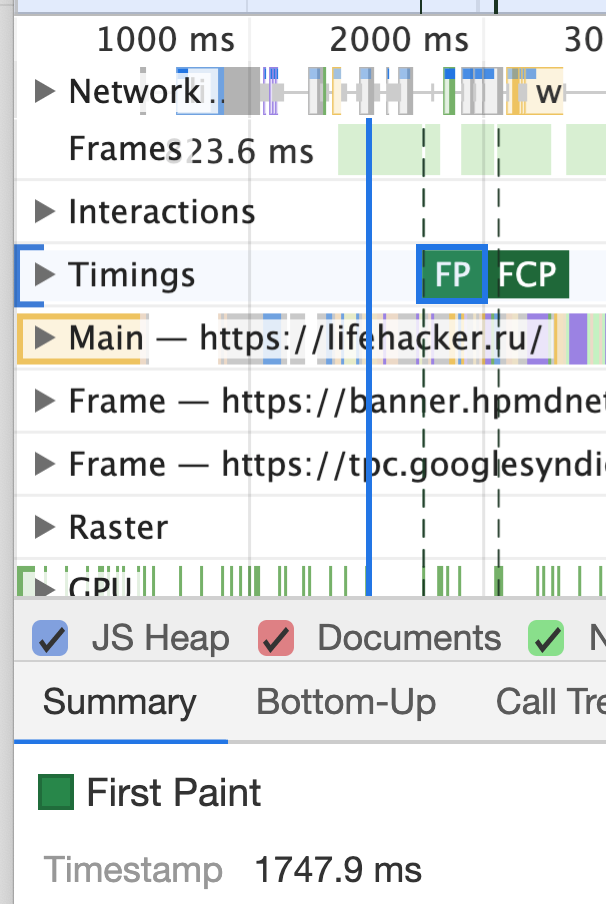

Время от начала загрузки до события First Meaningful Paint `~2932ms`.

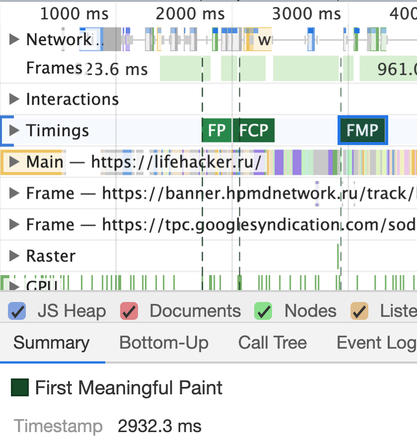

Время от начала загрузки до события DOM Content Loaded `~3998ms`.

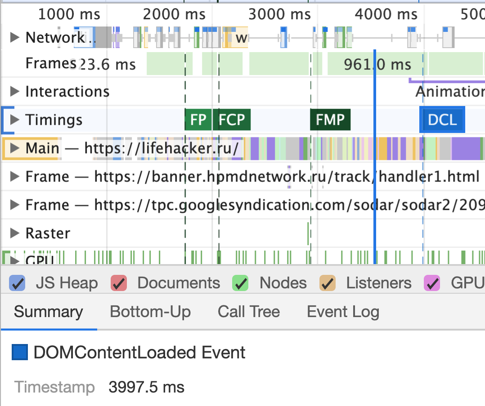

Время от начала загрузки до события Load `~8000ms`.

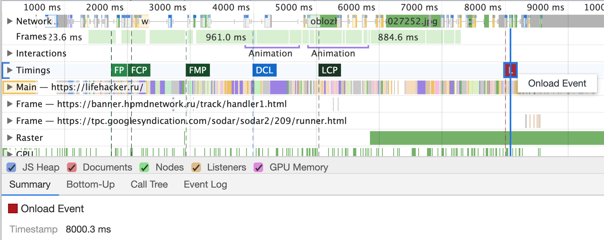

Общее время на обработку документа:
- Loading (`~181ms`)
- Scripting (`~4231ms`)
- Rendering (`~1236ms`)
- Painting (`~333ms`)

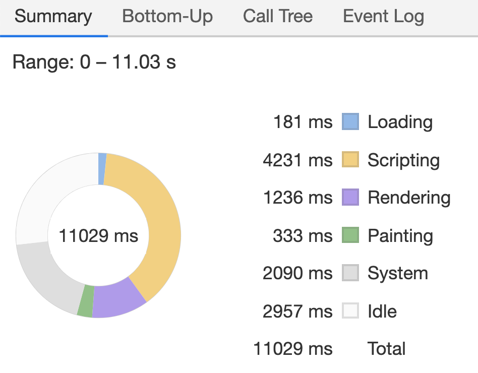

## Вкладка Coverage 
([вернуться к содержанию](#contents))

Вкладка `Coverage` после загрузки выглядит так.

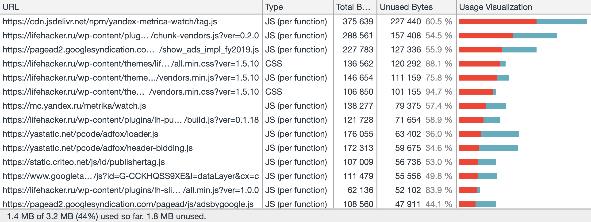

Объем неиспользованного CSS  `~387 KB` (`~12%` от всего CSS).

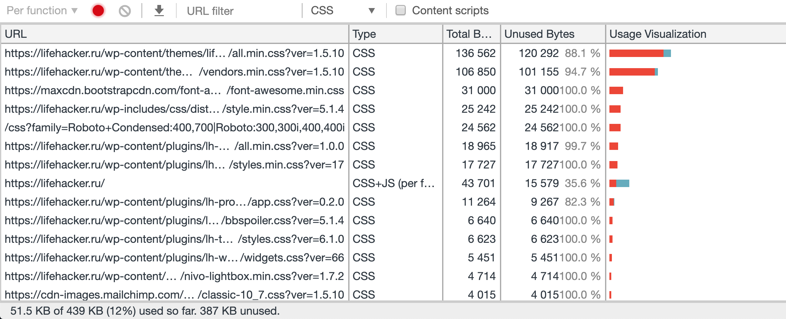

Некоторые CSS при загрузке не используются вообще (100% unused).
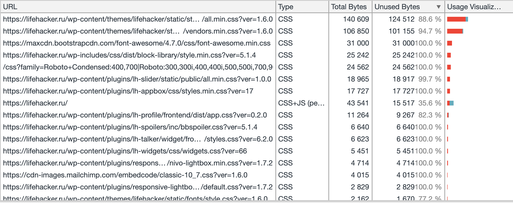

Объем неиспользованного JS - `1.4 MB`  (`~50%` от всего JS).

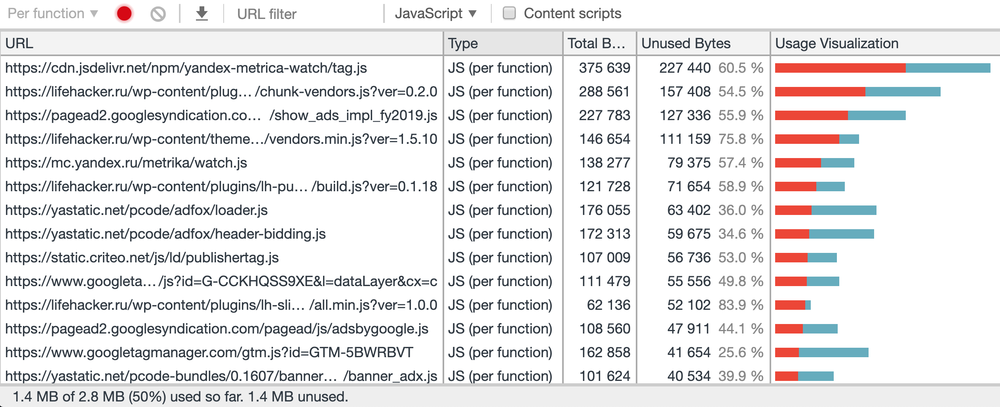

Реальный объем неиспользуемого кода (на который может быть направлены наша оптимизация) меньше, т.к.: 
- часть CSS/JS принадлежит сторонним ресурсам, например Яндекс.Метрики, Яндекс.ADFOX, Google.Analytics. Мы (как разработчики сайта) не можем повлиять на них напрямую. 
- изначально показан лишь использованный CSS/JS на момент загрузки. При взаимодействии с интерфейсом (открытие меню, скролл страницы, ховеры, открытие всплывающих окон) объем неиспользованного кода сокращается.
